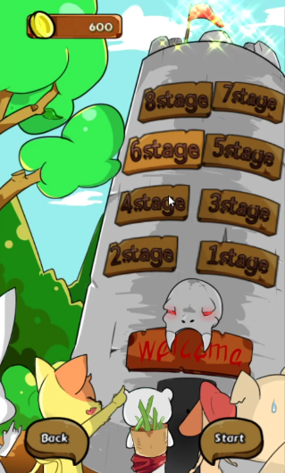
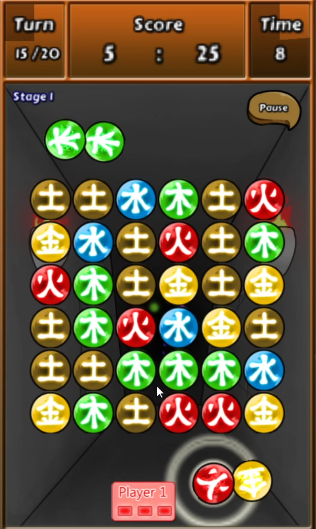

# OPang
|  |  |
| ----------------- | ----------------- |
|  |  |

#### 한국게임과학고등학교 3학년 여름방학 프로젝트

프로젝트 소개 : 오팡은 바둑이나 오목과 같이 대전형식의 퍼즐게임으로서 바둑돌을 두듯이 돌을 놓아 정확히 5개의 같은 색의 블록을 만들어 점수를 얻는것을 목표로 합니다. 같은색으로 4개를 맞추거나 6개를 맞추거나 7개를 맞추는것은 득점할 수 없습니다.

사용기술 : C++, Cocos2d-x. Android Java.

담당 역할 : 팀장, 프로그래밍 전체

개발기간 : 2012년 12월~ 2013년 3월

핵심 기술 / 알고리즘 : Unity3D 물리 적용, 5개 뭉친 블록을 체크 하는 알고리즘. **대전 인공지능 구현**. **네트워크 대전 게임 시도.** (초보적인 수준의 소켓프로그래밍으로 직접 구현)

플레이영상 : https://youtu.be/jf5GtzejAqE

프로젝트 주소 : https://github.com/justkoi/OPang

### 핵심 코드 설명

#### Block.cs : 게임 내 블록을 정의합니다.

https://github.com/justkoi/OPang/blob/main/%EA%B2%8C%EC%9E%84%ED%8C%8C%EC%9D%BC(C%23%2C%20Unity3d)/Assets/Scripts/GameScene/Block.cs

#### Magicblock.cs : 플레이어의 블록을 정의합니다.

https://github.com/justkoi/OPang/blob/main/%EA%B2%8C%EC%9E%84%ED%8C%8C%EC%9D%BC(C%23%2C%20Unity3d)/Assets/Scripts/GameScene/MagicBlock.cs

#### Deck.cs : 플레이어의 덱을 정의합니다. (플레이어 손에 들어온 블록들)

https://github.com/justkoi/OPang/blob/main/%EA%B2%8C%EC%9E%84%ED%8C%8C%EC%9D%BC(C%23%2C%20Unity3d)/Assets/Scripts/GameScene/Deck.cs

#### GameScene.cs : 게임 규칙 및 게임씬을 총괄합니다.

https://github.com/justkoi/OPang/blob/main/%EA%B2%8C%EC%9E%84%ED%8C%8C%EC%9D%BC(C%23%2C%20Unity3d)/Assets/Scripts/GameScene/GameScene.cs


### 인공지능 코드 설명

GameScene에서

인공지능을 레벨디자인에 활용하여 플레이어가 수준에 맞는 대전을 즐길 수 있도록 하였습니다.

따라서 게임의 스테이지 단계에 따라 인공지능이 여러가지 다른 경우의 수를 계산하도록 설계하였습니다.

게임의 기초단계에서 인공지능은 기본적인 행동과 랜덤으로 돌을 놓지만. 

게임의 단계가 올라가면서 4개에서 1개를 더 붙여서 5개의 블록을 맞추고

단계가 더올라가면 6개블록에서 1개를 끊어서 5개를 맞추기도하며

모든 경우의수를 전부 계산해서 착수하기도 합니다.

상대가 가지고있는 패를 계산해서 상대가 다음 돌을 5개를 놓지 못하도록 방해하는 행동등이 게임의 단계가 올라갈때마다 추가하도록 했습니다.

```C#
  //!< AI 인공지능으로 넘어갑니다.

                    //!< AI 인공지능 계산 단계

                    //!< AI 행동의 다음 행동에 대한 모든 계산을 끝내고

                    //!< SelectMagicBlock과
                    //!< SelectBlock값을 저장합니다.

                    else if (m_ePlayStep == E_PLAY_STEP.E_PLAY_STEP_AI_COMPUTING)
                    {
                        // m_pAI_PopList_6
                        bool m_bComputed = false;

                        AI_Pop();


                        ////!< 7개 모인 블록에 하나빼기

                        //if (m_bComputed == false && m_pAI_PopList_7.Count >= 1)
                        //{
                        //    int nDeckCount = 0;
                        //    for (nDeckCount = 0; nDeckCount < m_Deck_P2.m_eDeckList.Count; nDeckCount++)
                        //    {
                        //        if (m_Deck_P2.m_eDeckList[nDeckCount].GetComponent<MagicBlock>().m_eBlockNumber != m_pAI_PopList_7[0].m_BlockList[0].GetComponent<Block>().m_eBlockNumber)
                        //        {
                        //            m_goAI_SelectMagic = m_Deck_P2.m_eDeckList[nDeckCount].transform.gameObject;

                        //            break;
                        //        }
                        //    }

                        //    //for (int i = 0; i < m_pAI_PopList_6.Count; i++)
                        //    //{
                        //    if (nDeckCount >= m_Deck_P2.m_eDeckList.Count)
                        //    {

                        //    }
                        //    else
                        //    {
                        //        int k = 0;
                        //        for (k = 0; k < m_pAI_PopList_7[0].m_BlockList.Count; k++)
                        //        {
                        //            //m_pAI_PopList_6[0].m_BlockList[j].GetComponent
                        //            int nAnotherBlockIndex = 0;

                        //            m_goAI_SelectBlock = m_pAI_PopList_7[0].m_BlockList[k];

                        //            E_BLOCK_NUMBER eSaveBlockNumber = m_goAI_SelectBlock.GetComponent<Block>().m_eBlockNumber;

                        //            m_goAI_SelectBlock.GetComponent<Block>().m_eBlockNumber = m_goAI_SelectMagic.GetComponent<MagicBlock>().m_eBlockNumber;

                        //            nAnotherBlockIndex = k + 1;
                        //            if (nAnotherBlockIndex >= m_pAI_PopList_7[0].m_BlockList.Count)
                        //                nAnotherBlockIndex = 0;

                        //            for (int i = 0; i < m_goBlockList.Count; i++)
                        //            {
                        //                Block pBlock = m_goBlockList[i].GetComponent<Block>();
                        //                pBlock.CheckReset();
                        //            }

                        //            CPopList pCheckList = new CPopList();
                        //            pCheckList.Init(SearchBlock(m_pAI_PopList_7[0].m_BlockList[nAnotherBlockIndex].GetComponent<Block>().m_stIndex.m_nX, m_pAI_PopList_7[0].m_BlockList[nAnotherBlockIndex].GetComponent<Block>().m_stIndex.m_nY));

                        //            if (pCheckList.m_BlockList.Count == 5)
                        //            {

                        //                m_goAI_SelectBlock.GetComponent<Block>().m_eBlockNumber = eSaveBlockNumber;
                        //                m_bComputed = true;
                        //                m_ePlayStep = E_PLAY_STEP.E_PLAY_STEP_P2_SELECT_MAGIC;

                        //                Debug.Log("Case : 7Block");
                        //                break;

                        //            }

                        //            m_goAI_SelectBlock.GetComponent<Block>().m_eBlockNumber = eSaveBlockNumber;


                        //        }
                        //    }
                        //    //}
                        //}


                        //!< 6개 이상 모인 블록에 하나빼기

                        if (g_nStage >= 3 && m_bComputed == false && m_pAI_PopList_6.Count >= 1)
                        {
                            int nDeckCount = 0;
                            for (nDeckCount = 0; nDeckCount < m_Deck_P2.m_eDeckList.Count; nDeckCount++)
                            {
                                if (m_Deck_P2.m_eDeckList[nDeckCount].GetComponent<MagicBlock>().m_eBlockNumber != m_pAI_PopList_6[0].m_BlockList[0].GetComponent<Block>().m_eBlockNumber)
                                {
                                    m_goAI_SelectMagic = m_Deck_P2.m_eDeckList[nDeckCount].transform.gameObject;

                                    break;
                                }
                            }

                            //for (int i = 0; i < m_pAI_PopList_6.Count; i++)
                            //{
                            if (nDeckCount >= m_Deck_P2.m_eDeckList.Count)
                            {

                            }
                            else
                            {
                                int k = 0;
                                for (k = 0; k < m_pAI_PopList_6[0].m_BlockList.Count; k++)
                                {
                                    //m_pAI_PopList_6[0].m_BlockList[j].GetComponent
                                    int nAnotherBlockIndex = 0;

                                    m_goAI_SelectBlock = m_pAI_PopList_6[0].m_BlockList[k];

                                    E_BLOCK_NUMBER eSaveBlockNumber = m_goAI_SelectBlock.GetComponent<Block>().m_eBlockNumber;

                                    m_goAI_SelectBlock.GetComponent<Block>().m_eBlockNumber = m_goAI_SelectMagic.GetComponent<MagicBlock>().m_eBlockNumber;

                                    // nAnotherBlockIndex = k + 1;
                                    // if (nAnotherBlockIndex >= m_pAI_PopList_6[0].m_BlockList.Count)
                                    //    nAnotherBlockIndex = 0;

                                    for (int i = 0; i < m_goBlockList.Count; i++)
                                    {
                                        Block pBlock = m_goBlockList[i].GetComponent<Block>();
                                        pBlock.CheckReset();
                                    }

                                    for (int z = 0; z < m_pAI_PopList_6[0].m_BlockList.Count; z++)
                                    {
                                        if (z == k)
                                            continue;

                                        nAnotherBlockIndex = z;

                                        CPopList pCheckList = new CPopList();
                                        pCheckList.Init(SearchBlock(m_pAI_PopList_6[0].m_BlockList[nAnotherBlockIndex].GetComponent<Block>().m_stIndex.m_nX, m_pAI_PopList_6[0].m_BlockList[nAnotherBlockIndex].GetComponent<Block>().m_stIndex.m_nY));

                                        if (pCheckList.m_BlockList.Count == 5)
                                        {

                                            m_goAI_SelectBlock.GetComponent<Block>().m_eBlockNumber = eSaveBlockNumber;
                                            m_bComputed = true;
                                            m_ePlayStep = E_PLAY_STEP.E_PLAY_STEP_P2_SELECT_MAGIC;

                                            Debug.Log("Case : 6 Over Block (Code " + k.ToString() + " " + z.ToString() + ")");
                                            break;

                                        }
                                        if (m_bComputed == true)
                                            break;
                                    }
                                    if (m_bComputed == true)
                                        break;

                                    m_goAI_SelectBlock.GetComponent<Block>().m_eBlockNumber = eSaveBlockNumber;


                                }
                            }
                            //}
                        }

                        //!< 4개 모인블록에 하나 붙이기
                        if (g_nStage >= 1 && m_bComputed == false && m_pAI_PopList_4.Count >= 1)
                        {
                            int nDeckCount = 0;


                            for (nDeckCount = 0; nDeckCount < m_Deck_P2.m_eDeckList.Count; nDeckCount++)
                            {
                                if (m_Deck_P2.m_eDeckList[nDeckCount].GetComponent<MagicBlock>().m_eBlockNumber == m_pAI_PopList_4[0].m_BlockList[0].GetComponent<Block>().m_eBlockNumber)
                                {
                                    m_goAI_SelectMagic = m_Deck_P2.m_eDeckList[nDeckCount].transform.gameObject;
                                    break;
                                }
                            }

                            if (nDeckCount >= m_Deck_P2.m_eDeckList.Count)
                            {


                            }
                            else
                            {
                                E_BLOCK_NUMBER eNowBlockNumber = m_pAI_PopList_4[0].m_BlockList[0].GetComponent<Block>().m_eBlockNumber;
                                for (int i = 0; i < m_pAI_PopList_4[0].m_BlockList.Count; i++)
                                {
                                    int nBlock = 0;

                                    nBlock = SearchBlock(
                                        m_pAI_PopList_4[0].m_BlockList[i].GetComponent<Block>().m_stIndex.m_nX - 1,
                                        m_pAI_PopList_4[0].m_BlockList[i].GetComponent<Block>().m_stIndex.m_nY + 0);
                                    if (nBlock != -1)
                                    {
                                        if (m_goBlockList[nBlock].GetComponent<Block>().m_eBlockNumber != eNowBlockNumber)
                                            m_nAI_BlockList_4.Add(nBlock);
                                    }

                                    nBlock = SearchBlock(
                                        m_pAI_PopList_4[0].m_BlockList[i].GetComponent<Block>().m_stIndex.m_nX + 1,
                                        m_pAI_PopList_4[0].m_BlockList[i].GetComponent<Block>().m_stIndex.m_nY + 0);
                                    if (nBlock != -1)
                                    {
                                        if (m_goBlockList[nBlock].GetComponent<Block>().m_eBlockNumber != eNowBlockNumber)
                                            m_nAI_BlockList_4.Add(nBlock);
                                    }


                                    nBlock = SearchBlock(
                                        m_pAI_PopList_4[0].m_BlockList[i].GetComponent<Block>().m_stIndex.m_nX + 0,
                                        m_pAI_PopList_4[0].m_BlockList[i].GetComponent<Block>().m_stIndex.m_nY + 1);
                                    if (nBlock != -1)
                                    {
                                        if (m_goBlockList[nBlock].GetComponent<Block>().m_eBlockNumber != eNowBlockNumber)
                                            m_nAI_BlockList_4.Add(nBlock);
                                    }

                                    nBlock = SearchBlock(
                                        m_pAI_PopList_4[0].m_BlockList[i].GetComponent<Block>().m_stIndex.m_nX + 0,
                                        m_pAI_PopList_4[0].m_BlockList[i].GetComponent<Block>().m_stIndex.m_nY - 1);
                                    if (nBlock != -1)
                                    {
                                        if (m_goBlockList[nBlock].GetComponent<Block>().m_eBlockNumber != eNowBlockNumber)
                                            m_nAI_BlockList_4.Add(nBlock);
                                    }

                                }


                                int k = 0;
                                for (k = 0; k < m_nAI_BlockList_4.Count; k++)
                                {


                                    m_goAI_SelectBlock = m_goBlockList[m_nAI_BlockList_4[k]];

                                    E_BLOCK_NUMBER eSaveBlockNumber = m_goAI_SelectBlock.GetComponent<Block>().m_eBlockNumber;

                                    m_goAI_SelectBlock.GetComponent<Block>().m_eBlockNumber = m_goAI_SelectMagic.GetComponent<MagicBlock>().m_eBlockNumber;


                                    for (int i = 0; i < m_goBlockList.Count; i++)
                                    {
                                        Block pBlock = m_goBlockList[i].GetComponent<Block>();
                                        pBlock.CheckReset();
                                    }

                                    CPopList pCheckList = new CPopList();
                                    pCheckList.Init(SearchBlock(m_goAI_SelectBlock.GetComponent<Block>().m_stIndex.m_nX, m_goAI_SelectBlock.GetComponent<Block>().m_stIndex.m_nY));


                                    if (pCheckList.m_BlockList.Count == 5)
                                    {

                                        Debug.Log("Case : 4Block (Code " + k.ToString() + ")");
                                        m_goAI_SelectBlock.GetComponent<Block>().m_eBlockNumber = eSaveBlockNumber;
                                        m_bComputed = true;
                                        m_ePlayStep = E_PLAY_STEP.E_PLAY_STEP_P2_SELECT_MAGIC;

                                        break;

                                    }

                                    m_goAI_SelectBlock.GetComponent<Block>().m_eBlockNumber = eSaveBlockNumber;


                                }
                            }

                        }


                        //!< 전부 놓아보기
                        if (g_nStage >= 2 && m_bComputed == false)
                        {

                            int nDeckCount = 0;

                            for (nDeckCount = 0; nDeckCount < m_Deck_P2.m_eDeckList.Count; nDeckCount++)
                            {
                                Debug.Log(nDeckCount + "번째 덱에서 에러 /" + m_Deck_P2.m_eDeckList.Count);
                                m_goAI_SelectMagic = m_Deck_P2.m_eDeckList[nDeckCount].transform.gameObject;


                                int k = 0;
                                for (k = 0; k < m_goBlockList.Count; k++)
                                {


                                    m_goAI_SelectBlock = m_goBlockList[k];

                                    E_BLOCK_NUMBER eSaveBlockNumber = m_goAI_SelectBlock.GetComponent<Block>().m_eBlockNumber;

                                    m_goAI_SelectBlock.GetComponent<Block>().m_eBlockNumber = m_goAI_SelectMagic.GetComponent<MagicBlock>().m_eBlockNumber;


                                    for (int i = 0; i < m_goBlockList.Count; i++)
                                    {
                                        Block pBlock = m_goBlockList[i].GetComponent<Block>();
                                        pBlock.CheckReset();
                                    }

                                    CPopList pCheckList = new CPopList();
                                    pCheckList.Init(SearchBlock(m_goAI_SelectBlock.GetComponent<Block>().m_stIndex.m_nX, m_goAI_SelectBlock.GetComponent<Block>().m_stIndex.m_nY));


                                    if (pCheckList.m_BlockList.Count == 5)
                                    {

                                        Debug.Log("Case : AllSet (Code " + k.ToString() + ")");
                                        m_goAI_SelectBlock.GetComponent<Block>().m_eBlockNumber = eSaveBlockNumber;
                                        m_bComputed = true;
                                        m_ePlayStep = E_PLAY_STEP.E_PLAY_STEP_P2_SELECT_MAGIC;
                                        nDeckCount = m_Deck_P2.m_eDeckList.Count;
                                        break;

                                    }

                                    m_goAI_SelectBlock.GetComponent<Block>().m_eBlockNumber = eSaveBlockNumber;

                                }
                            }

                        }


                        //!< 견제하기

                        //!< 4개블록이 있고 적이 덱에 같은색의 블록을 가지고 있다면 4개블록위치에 랜덤으로 착수


                        if (g_nStage >= 4 && m_bComputed == false)
                        {

                            for(int i=0; i<m_pAI_PopList_4.Count; i++)
                            {

                                int nDeckNumberCheck = 0;
                                for (nDeckNumberCheck = 0; nDeckNumberCheck < m_Deck_P2.m_eDeckList.Count; nDeckNumberCheck++)
                                {
                                    if (m_Deck_P2.m_eDeckList[nDeckNumberCheck].m_eBlockNumber != m_pAI_PopList_4[i].m_BlockList[0].GetComponent<Block>().m_eBlockNumber)
                                        break;
                                }
                                if (nDeckNumberCheck >= m_Deck_P2.m_eDeckList.Count)
                                    continue;


                                for(int j=0; j<m_Deck_P1.m_eDeckList.Count; j++)
                                {

                                    //!< 4개뭉친 블록과 적의 덱의 색이 같음
                                    if (m_pAI_PopList_4[i].m_BlockList[0].GetComponent<Block>().m_eBlockNumber == m_Deck_P1.m_eDeckList[j].m_eBlockNumber)
                                    {
                                        int nSelectMagic = 0;
                                        int nSelectBlock = UnityEngine.Random.Range(0, m_pAI_PopList_4[i].m_BlockList.Count);

                                        while (true)
                                        {
                                            nSelectMagic = UnityEngine.Random.Range(0, m_Deck_P2.m_eDeckList.Count);
                                            //!< 같은 색 못둠
                                            if (m_Deck_P2.m_eDeckList[nSelectMagic].m_eBlockNumber != m_pAI_PopList_4[i].m_BlockList[0].GetComponent<Block>().m_eBlockNumber)
                                                break;
                                        }
                                        m_goAI_SelectMagic = m_Deck_P2.m_eDeckList[nSelectMagic].transform.gameObject;
                                        Debug.Log("[4] " + i + "/" + m_pAI_PopList_4.Count);
                                        m_goAI_SelectBlock = m_pAI_PopList_4[i].m_BlockList[nSelectBlock];
                                        Debug.Log("Case : Attack 4 Block (Code " + nSelectMagic.ToString() + " " + nSelectBlock.ToString() + ")");

                                        m_bComputed = true;
                                        m_ePlayStep = E_PLAY_STEP.E_PLAY_STEP_P2_SELECT_MAGIC;
                                        break;
                                    }

                                }
                                if (m_bComputed == true)
                                    break;
                            }
                        }


                        //!< 고난이도 견제하기

                        //!< 전부 블록을 놓아보고 터지는 경우 터지는 블록을 포함한 자리에 랜덤으로 착수


                        if (g_nStage >= 7 && m_bComputed == false)
                        {

                            int nColorCount = 0;

                            for (nColorCount = 0; nColorCount < (int)E_BLOCK_NUMBER.E_BLOCK_NUMBER_MAX; nColorCount++) //!< 모든 색상 전부 넣어봄
                            {
                                //m_goAI_SelectMagic = m_Deck_P2.m_eDeckList[nColorCount].transform.gameObject; //!< 덱에서 패를 뽑아 SelectMagic함


                                int k = 0;
                                for (k = 0; k < m_goBlockList.Count; k++) //!< 모든 블록의 위치에 한번씩 놓아봄
                                {


                                    m_goAI_SelectBlock = m_goBlockList[k]; //!< 선택

                                    E_BLOCK_NUMBER eSaveBlockNumber = m_goAI_SelectBlock.GetComponent<Block>().m_eBlockNumber; //!< 이전 블록색 저장

                                    if (m_goAI_SelectBlock.GetComponent<Block>().m_eBlockNumber == (E_BLOCK_NUMBER)nColorCount)
                                        continue;

                                    m_goAI_SelectBlock.GetComponent<Block>().m_eBlockNumber = (E_BLOCK_NUMBER)nColorCount;
                                    //!< 블록색 갈아치움

                                    for (int i = 0; i < m_goBlockList.Count; i++)
                                    {
                                        Block pBlock = m_goBlockList[i].GetComponent<Block>();
                                        pBlock.CheckReset();
                                    }
                                    //!< 터지는지 확인한다
                                    CPopList pCheckList = new CPopList();
                                    pCheckList.Init(SearchBlock(m_goAI_SelectBlock.GetComponent<Block>().m_stIndex.m_nX, m_goAI_SelectBlock.GetComponent<Block>().m_stIndex.m_nY));


                                    if (pCheckList.m_BlockList.Count == 5) //!< 터질경우
                                    {
                                        bool bChecked = false;
                                        int nDeckNumberCheck = 0;
                                        for (nDeckNumberCheck = 0; nDeckNumberCheck < m_Deck_P1.m_eDeckList.Count; nDeckNumberCheck++)
                                        {
                                            if (m_Deck_P1.m_eDeckList[nDeckNumberCheck].m_eBlockNumber == pCheckList.m_BlockList[0].GetComponent<Block>().m_eBlockNumber)
                                            {
                                                int nP2Check = 0;
                                                for(nP2Check = 0; nP2Check < m_Deck_P2.m_eDeckList.Count; nP2Check++)
                                                {
                                                    Debug.Log("nP2Check : " + nP2Check.ToString() );

                                                    if (pCheckList.m_BlockList[0].GetComponent<Block>().m_eBlockNumber != m_Deck_P2.m_eDeckList[nP2Check].GetComponent<MagicBlock>().m_eBlockNumber)
                                                    {
                                                        break;
                                                    }
                                                }

                                                if (nP2Check < m_Deck_P2.m_eDeckList.Count)
                                                {
                                                    bChecked = true;
                                                    break;
                                                }
                                            }
                                        }

                                        if (bChecked == true)
                                        {
                                            m_goAI_SelectBlock.GetComponent<Block>().m_eBlockNumber = eSaveBlockNumber;

                                            Debug.Log("Case : Attack Allset (Code " + k.ToString() + ")");

                                            int nSelectMagic = 0;
                                            int nSelectBlock = UnityEngine.Random.Range(0, pCheckList.m_BlockList.Count);

                                            while (true)
                                            {
                                                nSelectMagic = UnityEngine.Random.Range(0, m_Deck_P2.m_eDeckList.Count);
                                                //!< 같은 색 못둠
                                                if (m_Deck_P2.m_eDeckList[nSelectMagic].m_eBlockNumber != pCheckList.m_BlockList[0].GetComponent<Block>().m_eBlockNumber)
                                                    break;

                                                if (m_Deck_P2.m_eDeckList[0].m_eBlockNumber == m_Deck_P2.m_eDeckList[1].m_eBlockNumber)
                                                    break;
                                            }


                                            while (true)
                                            {
                                                nSelectBlock = UnityEngine.Random.Range(0, pCheckList.m_BlockList.Count);
                                                //!< 두었던 블록이 아니면 빠져나
                                                if (pCheckList.m_BlockList[nSelectBlock] != m_goAI_SelectBlock)
                                                    break;
                                            }

                                            //!< 현재 블록리스트중에 랜덤으로 착수 //!< 단 SelectBlock의 위치는 제외

                                            m_goAI_SelectMagic = m_Deck_P2.m_eDeckList[nSelectMagic].transform.gameObject;
                                            m_goAI_SelectBlock = pCheckList.m_BlockList[nSelectBlock];

                                            m_bComputed = true;
                                            m_ePlayStep = E_PLAY_STEP.E_PLAY_STEP_P2_SELECT_MAGIC;
                                            nColorCount = m_Deck_P2.m_eDeckList.Count;
                                            break;

                                         }

                                     }

                                    m_goAI_SelectBlock.GetComponent<Block>().m_eBlockNumber = eSaveBlockNumber;
                                }

                                if (m_bComputed == true)
                                    break;
                            }

                        }

                        //!< 3개블록이 있고 적이 덱에 같은색의 블록을 가지고 있다면 4개블록위치에 랜덤으로 착수
                        if (g_nStage >= 5 && m_bComputed == false)
                        {

                            for (int i = 0; i < m_pAI_PopList_3.Count; i++)
                            {
                                int nDeckNumberCheck = 0;
                                for (nDeckNumberCheck = 0; nDeckNumberCheck < m_Deck_P2.m_eDeckList.Count; nDeckNumberCheck++)
                                {
                                    if (m_Deck_P2.m_eDeckList[nDeckNumberCheck].m_eBlockNumber != m_pAI_PopList_3[i].m_BlockList[0].GetComponent<Block>().m_eBlockNumber)
                                        break;
                                }
                                if (nDeckNumberCheck >= m_Deck_P2.m_eDeckList.Count)
                                    continue;


                                for (int j = 0; j < m_Deck_P1.m_eDeckList.Count; j++)
                                {

                                    //!< 3개뭉친 블록과 적의 덱의 색이 같음
                                    if (m_pAI_PopList_3[i].m_BlockList[0].GetComponent<Block>().m_eBlockNumber == m_Deck_P1.m_eDeckList[j].m_eBlockNumber)
                                    {
                                        int nSelectMagic = 0;
                                        int nSelectBlock = UnityEngine.Random.Range(0, m_pAI_PopList_3[i].m_BlockList.Count);

                                        while (true)
                                        {
                                            nSelectMagic = UnityEngine.Random.Range(0, m_Deck_P2.m_eDeckList.Count);
                                            //!< 같은 색 못둠
                                            if (m_Deck_P2.m_eDeckList[nSelectMagic].m_eBlockNumber != m_pAI_PopList_3[i].m_BlockList[0].GetComponent<Block>().m_eBlockNumber)
                                                break;
                                        }


                                        m_goAI_SelectMagic = m_Deck_P2.m_eDeckList[nSelectMagic].transform.gameObject;
                                        Debug.Log("[3] "+ i + "/" + m_pAI_PopList_3.Count);
                                        m_goAI_SelectBlock = m_pAI_PopList_3[i].m_BlockList[nSelectBlock];
                                        Debug.Log("Case : Attack 3 Block (Code " + nSelectMagic.ToString() + " " + nSelectBlock.ToString() + ")");

                                        m_bComputed = true;
                                        m_ePlayStep = E_PLAY_STEP.E_PLAY_STEP_P2_SELECT_MAGIC;
                                        break;
                                    }

                                }
                            }
                        }

                        //!< 다음 한 수를 멀리 내다봄

                        /* int nSelectMagic = UnityEngine.Random.Range(0, 2);
                                        int nSelectBlock = UnityEngine.Random.Range(0, m_pAI_PopList_4.Count);
                                        m_goAI_SelectMagic = m_Deck_P2.m_eDeckList[nSelectMagic].transform.gameObject;
                                        m_goAI_SelectBlock = m_pAI_PopList_4[i].m_BlockList[nSelectBlock];
                                        Debug.Log("Case : Attack 4 Block (Code " + nSelectMagic.ToString() + nSelectBlock.ToString() + ")");
                                        m_bComputed = true;
                                        m_ePlayStep = E_PLAY_STEP.E_PLAY_STEP_P2_SELECT_MAGIC;
                        */

                        //!< 3개 블록이 있고 적이 덱에 같은색의 블록을 가지고 있지 않으며 나에게 그 모인 색의 블록이 있다면 이어서 착수
                        if (g_nStage >= 6 && m_bComputed == false)
                        {
                            int nDeckCheck = 0;
                            int nDeckCheck2 = 0;
                            for (int i = 0; i < m_pAI_PopList_3.Count; i++)
                            {
                                for (nDeckCheck = 0; nDeckCheck < m_Deck_P1.m_eDeckList.Count; nDeckCheck++)
                                {
                                    //!< 3개뭉친 블록과 적의 덱의 색이 전부 같지 않음 (같으면 빠져나감)
                                    if (m_pAI_PopList_3[i].m_BlockList[0].GetComponent<Block>().m_eBlockNumber == m_Deck_P1.m_eDeckList[nDeckCheck].m_eBlockNumber)
                                        break;

                                }
                                for (nDeckCheck2 = 0; nDeckCheck2 < m_Deck_P2.m_eDeckList.Count; nDeckCheck2++)
                                {
                                    //!< 3개뭉친 블록의 색이 나에게 있음
                                    if (m_pAI_PopList_3[i].m_BlockList[0].GetComponent<Block>().m_eBlockNumber == m_Deck_P2.m_eDeckList[nDeckCheck2].m_eBlockNumber)
                                        break;

                                }
                                if (nDeckCheck >= m_Deck_P1.m_eDeckList.Count && nDeckCheck2 < m_Deck_P2.m_eDeckList.Count )
                                {
                                    for (int n = 0; n < m_pAI_PopList_3[i].m_BlockList.Count; n++)
                                    {
                                        int nBlock = 0;
                                        int nX = 0;
                                        int nY = 0;

                                        bool nPass = true;


                                        //!< Check /////////////////////////////////
                                        nPass = true;
                                        nX = m_pAI_PopList_3[i].m_BlockList[n].GetComponent<Block>().m_stIndex.m_nX - 1;
                                        nY = m_pAI_PopList_3[i].m_BlockList[n].GetComponent<Block>().m_stIndex.m_nY + 0;

                                        for (int u = 0; u < m_pAI_PopList_3[i].m_BlockList.Count; u++)
                                        {
                                            if (nX == m_pAI_PopList_3[i].m_BlockList[u].GetComponent<Block>().m_stIndex.m_nX &&
                                                nY == m_pAI_PopList_3[i].m_BlockList[u].GetComponent<Block>().m_stIndex.m_nY) //!< 인덱스가 블록묶음 자신과 겹치면 Pass를 false함
                                            {
                                                nPass = false;
                                                break;
                                            }
                                        }
                                        // ////////////////////////////////////////

                                        if (nPass == true)
                                        {
                                            nBlock = SearchBlock(
                                                m_pAI_PopList_3[i].m_BlockList[n].GetComponent<Block>().m_stIndex.m_nX - 1,
                                                m_pAI_PopList_3[i].m_BlockList[n].GetComponent<Block>().m_stIndex.m_nY + 0);

                                            if (nBlock != -1)
                                            {
                                                int nSelectBlock = UnityEngine.Random.Range(0, m_pAI_PopList_4.Count);

                                                m_goAI_SelectMagic = m_Deck_P2.m_eDeckList[nDeckCheck2].transform.gameObject;
                                                m_goAI_SelectBlock = m_goBlockList[nBlock];

                                                Debug.Log("Case : Flow 3 Block (Code " + nDeckCheck2.ToString() + " " + nBlock.ToString() + ")");

                                                m_bComputed = true;
                                                m_ePlayStep = E_PLAY_STEP.E_PLAY_STEP_P2_SELECT_MAGIC;
                                                break;
                                            }
                                        }


                                        //!< Check /////////////////////////////////
                                        nPass = true;
                                        nX = m_pAI_PopList_3[i].m_BlockList[n].GetComponent<Block>().m_stIndex.m_nX + 1;
                                        nY = m_pAI_PopList_3[i].m_BlockList[n].GetComponent<Block>().m_stIndex.m_nY + 0;

                                        for (int u = 0; u < m_pAI_PopList_3[i].m_BlockList.Count; u++)
                                        {
                                            if (nX == m_pAI_PopList_3[i].m_BlockList[u].GetComponent<Block>().m_stIndex.m_nX &&
                                                nY == m_pAI_PopList_3[i].m_BlockList[u].GetComponent<Block>().m_stIndex.m_nY) //!< 인덱스가 블록묶음 자신과 겹치면 Pass를 false함
                                            {
                                                nPass = false;
                                                break;
                                            }
                                        }
                                        // ////////////////////////////////////////

                                        if (nPass == true)
                                        {
                                            nBlock = SearchBlock(
                                                m_pAI_PopList_3[i].m_BlockList[n].GetComponent<Block>().m_stIndex.m_nX + 1,
                                                m_pAI_PopList_3[i].m_BlockList[n].GetComponent<Block>().m_stIndex.m_nY + 0);
                                            if (nBlock != -1)
                                            {
                                                int nSelectBlock = UnityEngine.Random.Range(0, m_pAI_PopList_4.Count);

                                                m_goAI_SelectMagic = m_Deck_P2.m_eDeckList[nDeckCheck2].transform.gameObject;
                                                m_goAI_SelectBlock = m_goBlockList[nBlock];

                                                Debug.Log("Case : Flow 3 Block (Code " + nDeckCheck2.ToString() + " " + nBlock.ToString() + ")");

                                                m_bComputed = true;
                                                m_ePlayStep = E_PLAY_STEP.E_PLAY_STEP_P2_SELECT_MAGIC;
                                                break;
                                            }
                                        }


                                        //!< Check /////////////////////////////////
                                        nPass = true;
                                        nX = m_pAI_PopList_3[i].m_BlockList[n].GetComponent<Block>().m_stIndex.m_nX + 0;
                                        nY = m_pAI_PopList_3[i].m_BlockList[n].GetComponent<Block>().m_stIndex.m_nY - 1;

                                        for (int u = 0; u < m_pAI_PopList_3[i].m_BlockList.Count; u++)
                                        {
                                            if (nX == m_pAI_PopList_3[i].m_BlockList[u].GetComponent<Block>().m_stIndex.m_nX &&
                                                nY == m_pAI_PopList_3[i].m_BlockList[u].GetComponent<Block>().m_stIndex.m_nY) //!< 인덱스가 블록묶음 자신과 겹치면 Pass를 false함
                                            {
                                                nPass = false;
                                                break;
                                            }
                                        }
                                        // ////////////////////////////////////////

                                        if (nPass == true)
                                        {
                                            nBlock = SearchBlock(
                                                m_pAI_PopList_3[i].m_BlockList[n].GetComponent<Block>().m_stIndex.m_nX + 0,
                                                m_pAI_PopList_3[i].m_BlockList[n].GetComponent<Block>().m_stIndex.m_nY - 1);
                                            if (nBlock != -1)
                                            {
                                                int nSelectBlock = UnityEngine.Random.Range(0, m_pAI_PopList_4.Count);

                                                m_goAI_SelectMagic = m_Deck_P2.m_eDeckList[nDeckCheck2].transform.gameObject;
                                                m_goAI_SelectBlock = m_goBlockList[nBlock];

                                                Debug.Log("Case : Flow 3 Block (Code " + nDeckCheck2.ToString() + " " + nBlock.ToString() + ")");

                                                m_bComputed = true;
                                                m_ePlayStep = E_PLAY_STEP.E_PLAY_STEP_P2_SELECT_MAGIC;
                                                break;
                                            }
                                        }

                                        //!< Check /////////////////////////////////
                                        nPass = true;
                                        nX = m_pAI_PopList_3[i].m_BlockList[n].GetComponent<Block>().m_stIndex.m_nX + 0;
                                        nY = m_pAI_PopList_3[i].m_BlockList[n].GetComponent<Block>().m_stIndex.m_nY + 1;

                                        for (int u = 0; u < m_pAI_PopList_3[i].m_BlockList.Count; u++)
                                        {
                                            if (nX == m_pAI_PopList_3[i].m_BlockList[u].GetComponent<Block>().m_stIndex.m_nX &&
                                                nY == m_pAI_PopList_3[i].m_BlockList[u].GetComponent<Block>().m_stIndex.m_nY) //!< 인덱스가 블록묶음 자신과 겹치면 Pass를 false함
                                            {
                                                nPass = false;
                                                break;
                                            }
                                        }
                                        // ////////////////////////////////////////

                                        if (nPass == true)
                                        {
                                            nBlock = SearchBlock(
                                                m_pAI_PopList_3[i].m_BlockList[n].GetComponent<Block>().m_stIndex.m_nX + 0,
                                                m_pAI_PopList_3[i].m_BlockList[n].GetComponent<Block>().m_stIndex.m_nY + 1);
                                            if (nBlock != -1)
                                            {
                                                int nSelectBlock = UnityEngine.Random.Range(0, m_pAI_PopList_4.Count);

                                                m_goAI_SelectMagic = m_Deck_P2.m_eDeckList[nDeckCheck2].transform.gameObject;
                                                m_goAI_SelectBlock = m_goBlockList[nBlock];

                                                Debug.Log("Case : Flow 3 Block (Code " + nDeckCheck2.ToString() + " " + nBlock.ToString() + ")");

                                                m_bComputed = true;
                                                m_ePlayStep = E_PLAY_STEP.E_PLAY_STEP_P2_SELECT_MAGIC;
                                                break;
                                            }
                                        }

                                        if (m_bComputed == true)
                                            break;
                                    }

                                }

                            if (m_bComputed == true)
                                break;
                            }   
                        }


                        //!< 랜덤하게 놓기

                        if (m_bComputed == false)
                        {
                            Debug.Log("Case : Random");

                            while (true)
                            {
                                int nRandomMagic = UnityEngine.Random.Range(0, m_Deck_P2.m_eDeckList.Count);
                                int nRandomBlock = UnityEngine.Random.Range(0, m_goBlockList.Count);
                                m_goAI_SelectMagic = m_Deck_P2.m_eDeckList[nRandomMagic].transform.gameObject;
                                m_goAI_SelectBlock = m_goBlockList[nRandomBlock];

                                //!< 같은 색상의 블록에는 놓을 수 없다.
                                if (m_goAI_SelectBlock.GetComponent<Block>().m_eBlockNumber != m_goAI_SelectMagic.GetComponent<MagicBlock>().m_eBlockNumber)
                                {
                                    Debug.Log("Case : Random <- ColorSet");
                                    break;
                                }

                            }


                            m_bComputed = true;
                            m_ePlayStep = E_PLAY_STEP.E_PLAY_STEP_P2_SELECT_MAGIC;

                        }


                        m_fAI_Select_Magic_Time = UnityEngine.Random.Range(m_fAI_Select_Magic_Time_Min, m_fAI_Select_Magic_Time_Max);
                        m_fAI_Select_Block_Time = UnityEngine.Random.Range(m_fAI_Select_Block_Time_Min, m_fAI_Select_Block_Time_Max);


                        //!< 계산시에 사용한 Object들 초기화

                        m_pAI_PopList_3.Clear();
                        m_pAI_PopList_4.Clear();
                        m_pAI_PopList_6.Clear();
                        //m_pAI_PopList_7.Clear();
                    }

```


### 네트워크 관련 코드 설명

클라이언트 : GameScene.cpp에서

```C#
private void OnReceive(object sender, AsyncSocketReceiveEventArgs e)
    {


        Debug.Log("Receive!");

        string strCommand = Encoding.Unicode.GetString(e.ReceiveData, 0, (int)E_NETWORK_COMMAND.E_NETWORK_COMMAND_BITE); //!< 전송받은 데이터의 유형을 분석합니다.
        string strData = Encoding.Unicode.GetString(e.ReceiveData, (int)E_NETWORK_COMMAND.E_NETWORK_COMMAND_BITE, e.ReceiveBytes - (int)E_NETWORK_COMMAND.E_NETWORK_COMMAND_BITE); //!< 전송받은 데이터를 확인합니다


        string strTemp = null;

        int nSeek = 0;
        const int nSeekCount = 2;


        if (strCommand == ((int)E_NETWORK_COMMAND.E_NETWORK_COMMAND_P1_DRAW_FROM_SERVER).ToString())
        {
            nSeek += (int)E_NETWORK_COMMAND.E_NETWORK_COMMAND_BITE;

            Debug.Log("Step1-1" + nSeek+"/" + strCommand);
            Debug.Log("Is True? : " + (strCommand == ((int)E_NETWORK_COMMAND.E_NETWORK_COMMAND_P1_DRAW_FROM_SERVER).ToString()));
            Debug.Log("Is True? : " + (strCommand == ((int)E_NETWORK_COMMAND.E_NETWORK_COMMAND_P2_DRAW_FROM_SERVER).ToString()));

            while (true)
            {
                if (strCommand == ((int)E_NETWORK_COMMAND.E_NETWORK_COMMAND_P1_DRAW_FROM_SERVER).ToString())
                {
                    string strNumber = Encoding.Unicode.GetString(e.ReceiveData, nSeek, nSeekCount); //!< 전송받은 데이터를 확인합니다
                    

                    nSeek += nSeekCount;
                    int nRandomNumber = Int32.Parse(strNumber);

                    Debug.Log("Number : " + nRandomNumber);

                    Draw(1, nRandomNumber);

                    //strTemp = string.Format("[{0}]님이 P1의 Draw를 요청합니다. Code[{1}]", clientList[nIndex].strName, nRandomNumber);
                    Console.WriteLine("P1Draw");

                    //strTemp = string.Format("{0}{1}", ((int)E_NETWORK_COMMAND.E_NETWORK_COMMAND_P1_DRAW_FROM_SERVER).ToString(), nRandomNumber);

                }
                else if (strCommand == ((int)E_NETWORK_COMMAND.E_NETWORK_COMMAND_P2_DRAW_FROM_SERVER).ToString())
                {
                    string strNumber = Encoding.Unicode.GetString(e.ReceiveData, nSeek, nSeekCount); //!< 전송받은 데이터를 확인합니다
                    nSeek += nSeekCount;
                    int nRandomNumber = Int32.Parse(strNumber);
                    Draw(2, nRandomNumber);

                    //strTemp = string.Format("[{0}]님이 P2의 Draw를 요청합니다. Code[{1}]", clientList[nIndex].strName, nRandomNumber);
                    Console.WriteLine("P2Draw");

                   // strTemp = string.Format("{0}{1}", ((int)E_NETWORK_COMMAND.E_NETWORK_COMMAND_P2_DRAW_FROM_SERVER).ToString(), nRandomNumber);


                }

                if (nSeek >= e.ReceiveBytes)
                {
                    Console.WriteLine("메세지의 끝입니다.(루프 탈출)");
                    break;
                }
            }

            //int nRandomNumber = Int32.Parse(strData);
            
            //Console.WriteLine(strTemp);
            Debug.Log("Receive_P1_Draw");
        }
        else if (strCommand == ((int)E_NETWORK_COMMAND.E_NETWORK_COMMAND_P2_DRAW_FROM_SERVER).ToString())
        {
            nSeek += (int)E_NETWORK_COMMAND.E_NETWORK_COMMAND_BITE;

            Debug.Log("Step1-2/" + nSeek + "/" + strCommand);
            Debug.Log("Is True? : " + (strCommand == ((int)E_NETWORK_COMMAND.E_NETWORK_COMMAND_P1_DRAW_FROM_SERVER).ToString()));
            Debug.Log("Is True? : " + (strCommand == ((int)E_NETWORK_COMMAND.E_NETWORK_COMMAND_P2_DRAW_FROM_SERVER).ToString()));


            while (true)
            {
                if (strCommand == ((int)E_NETWORK_COMMAND.E_NETWORK_COMMAND_P1_DRAW_FROM_SERVER).ToString())
                {
                    string strNumber = Encoding.Unicode.GetString(e.ReceiveData, nSeek, nSeekCount); //!< 전송받은 데이터를 확인합니다
                    nSeek += nSeekCount;
                    int nRandomNumber = Int32.Parse(strNumber);

                    Debug.Log("Number : " + nRandomNumber);

                    Draw(1, nRandomNumber);

                    //strTemp = string.Format("[{0}]님이 P1의 Draw를 요청합니다. Code[{1}]", clientList[nIndex].strName, nRandomNumber);
                    Console.WriteLine("P1Draw");

                    //strTemp = string.Format("{0}{1}", ((int)E_NETWORK_COMMAND.E_NETWORK_COMMAND_P1_DRAW_FROM_SERVER).ToString(), nRandomNumber);


                }
                else if (strCommand == ((int)E_NETWORK_COMMAND.E_NETWORK_COMMAND_P2_DRAW_FROM_SERVER).ToString())
                {
                    string strNumber = Encoding.Unicode.GetString(e.ReceiveData, nSeek, nSeekCount); //!< 전송받은 데이터를 확인합니다
                    nSeek += nSeekCount;
                    int nRandomNumber = Int32.Parse(strNumber);
                    Draw(2, nRandomNumber);

                    //strTemp = string.Format("[{0}]님이 P2의 Draw를 요청합니다. Code[{1}]", clientList[nIndex].strName, nRandomNumber);
                    Console.WriteLine("P2Draw");

                    // strTemp = string.Format("{0}{1}", ((int)E_NETWORK_COMMAND.E_NETWORK_COMMAND_P2_DRAW_FROM_SERVER).ToString(), nRandomNumber);


                }

                if (nSeek >= e.ReceiveBytes)
                {
                    Console.WriteLine("메세지의 끝입니다.(루프 탈출)");
                    break;
                }
            }

            //int nRandomNumber = Int32.Parse(strData);

            //Console.WriteLine(strTemp);
            Debug.Log("Receive_P1_Draw");
        }
        
    }
```

서버 : SecretTalk_Server에서 [당시 게임 로비에 존재했던 채팅프로그램으로 시작하였습니다.] (이후 네트워크 도입 무산으로 삭제)

https://github.com/justkoi/OPang/blob/main/%EA%B2%8C%EC%9E%84%ED%8C%8C%EC%9D%BC(C%23%2C%20%EC%84%9C%EB%B2%84)/2013%EB%85%845%EC%9B%948%EC%9D%BC/SecretTalk_Server/Program.cs

```C#
using System;
using System.Collections.Generic;
using System.Linq;
using System.Text;
using System.Net;
using System.Net.Sockets;
using AsyncSocket;
using System.Text.RegularExpressions;
using System.IO;
using System.Threading;


namespace SecretTalk_Server
{

    public enum E_BLOCK_NUMBER
    {
        E_BLOCK_NUMBER_WATER,
        E_BLOCK_NUMBER_FIRE,
        E_BLOCK_NUMBER_METAL,
        E_BLOCK_NUMBER_WOOD,
        E_BLOCK_NUMBER_EARTH,
        E_BLOCK_NUMBER_MAX,
        E_BLOCK_NUMBER_ITEM_RAINBOW,
        E_BLOCK_NUMBER_ITEM_RESET,
    };

    public enum E_BLOCK_LIGHT
    {
        E_BLOCK_LIGHT_BLACK,
        E_BLOCK_LIGHT_WHITE,
        E_BLOCK_LIGHT_MAX
    };

    public enum E_BLOCK_STATE
    {
        E_BLOCK_STATE_NONE,
        E_BLOCK_STATE_CREATING,
        E_BLOCK_STATE_ACT,
        E_BLOCK_STATE_CHANGING,
    };

    public enum E_BLOCK_MODE
    {
        E_BLOCK_MODE_COLOR,
        E_BLOCK_MODE_RUNE,
        E_BLOCK_MODE_MAX
    }
    public enum E_NETWORK_COMMAND //!< 4자리의 네트워크 커맨드
    {
        E_NETWORK_COMMAND_BITE = 8, //!< 유니코드는 8바이트를 읽습니다....^^~~
        E_NETWORK_COMMAND_NAME = 1001, //!< 사용자 이름 및 계정생성 요청
        E_NETWORK_COMMAND_CHAT = 1002, //!< 채팅 메세지 송수신
        E_NETWORK_COMMAND_LIST = 1003, //!< 접속 리스트 요청
        E_NETWORK_COMMAND_ROOM = 1004, //!< 방 정보 요청
        E_NETWORK_COMMAND_JOIN = 1005, //!< 방 입장 요청
        E_NETWORK_COMMAND_MATCH = 1006, //!< 매치 대기열 등록
        E_NETWORK_COMMAND_START = 1007, //!< 게임 시작 요청

        E_NETWORK_COMMAND_P1_DRAW_FROM_CLIENT = 1101, //!< P1_Draw (패 뽑기) 요청
        E_NETWORK_COMMAND_P2_DRAW_FROM_CLIENT = 1201, //!< P2_Draw (패 뽑기) 요청
        E_NETWORK_COMMAND_P1_DRAW_FROM_SERVER = 2101, //!< P1_Draw (패 뽑기) 명령
        E_NETWORK_COMMAND_P2_DRAW_FROM_SERVER = 2201, //!< P2_Draw (패 뽑기) 명령

        E_NETWORK_COMMAND_P1_SELECT_MB_FROM_CLIENT = 1102, //!< P1_SelectMagicBlock (패 선택) 요청
        E_NETWORK_COMMAND_P2_SELECT_MB_FROM_CLIENT = 1202, //!< P2_SelectMagicBlock (패 선택) 요청
        E_NETWORK_COMMAND_P1_SELECT_MB_FROM_SERVER = 2102, //!< P1_SelectMagicBlock (패 선택) 명령
        E_NETWORK_COMMAND_P2_SELECT_MB_FROM_SERVER = 2202, //!< P2_SelectMagicBlock (패 선택) 명령

        E_NETWORK_COMMAND_P1_PUT_BLOCK_FROM_CLIENT = 1103, //!< P1_SelectMagicBlock (패 놓기) 요청
        E_NETWORK_COMMAND_P2_PUT_BLOCK_FROM_CLIENT = 1203, //!< P2_SelectMagicBlock (패 놓기) 요청
        E_NETWORK_COMMAND_P1_PUT_BLOCK_FROM_SERVER = 2103, //!< P1_SelectMagicBlock (패 놓기) 명령
        E_NETWORK_COMMAND_P2_PUT_BLOCK_FROM_SERVER = 2203, //!< P2_SelectMagicBlock (패 놓기) 명령

        E_NETWORK_COMMAND_P1_CREATE_BLOCK_FROM_CLIENT = 1104, //!< P1_SelectMagicBlock (블록 생성) 요청
        E_NETWORK_COMMAND_P2_CREATE_BLOCK_FROM_CLIENT = 1204, //!< P2_SelectMagicBlock (블록 생성) 요청
        E_NETWORK_COMMAND_P1_CREATE_BLOCK_FROM_SERVER = 2104, //!< P1_SelectMagicBlock (블록 생성) 명령
        E_NETWORK_COMMAND_P2_CREATE_BLOCK_FROM_SERVER = 2204, //!< P2_SelectMagicBlock (블록 생성) 명령
    }

    class Room
    {

        public List<int> m_nClientList = new List<int>(); //!< 룸에 접속한 클라이언트 인덱스번호
        public string m_strRoomName = "TestRoom";
        public int m_nMax = 6;
        public int m_nIndex = 0;

        public Room(string strRoomName, int nMax)
        {
            m_strRoomName = strRoomName;
            m_nMax = nMax;
            m_nIndex = Program.g_nRoomIndex++;
        }

        public int Join(int nClientIndex)
        {
            if (m_nClientList.Count >= m_nMax)
                return 0;

            Program.clientList[nClientIndex].nRoomNumber = m_nIndex;
            m_nClientList.Add(nClientIndex);
            
            return 1;

        }

        

        
    };

    class Program
    {
        static public AsyncSocketServer server;
        static public List<AsyncSocketClient> clientList;
        //static List<string> strNameList;
        static List<bool> g_bAsk_On = new List<bool>();

        static public int id;
        static public string strIP = null;

        static public int g_nRoomIndex = 0;


        static public List<Room> g_RoomList = new List<Room>();

        static public List<int> g_MatchList = new List<int>();

        static public byte[] buSize = new byte[4];

        static public int g_nStartTime = 0;

        static public Thread StartTimer = null;


        public const int D_MAP_WIDTH = 6;
        public const int D_MAP_HEIGHT = 6;

        static public int[,] g_nBlockMap = new int[D_MAP_WIDTH,D_MAP_HEIGHT];

        //static void CheckAsk(Object stateInfo)
        //{
        //    for (int i = 0; i < g_bAsk_On.Count; i++)
        //    {
        //        if(g_bAsk_On[i] == false)
        //        {
        //            Console.Write("\t**{0}/{0}**\t", i, strNameList.Count);
        //            Console.WriteLine("!>>응답하지 않는 클라이언트 [{0}]", strNameList[i]);
        //        }
        //    }
        //}


        static public void CreateNewRoom(string strRoomName, int nMax)
        {
            Room pTemp = new Room(strRoomName, nMax);
            
            g_RoomList.Add(pTemp);
            
        }

        public static string GetExternalIp()
        {

            //TimeSpan.FromSeconds(

           // DateTime.
            
            WebClient client = new WebClient();
            
            // Add a user agent header in case the requested URI contains a query.
            client.Headers.Add("user-agent", "Mozilla/4.0 (compatible; MSIE 6.0; Windows NT 5.2; .NET CLR1.0.3705;)");

            string baseurl = "http://checkip.dyndns.org/";

            Stream data = client.OpenRead(baseurl);
            StreamReader reader = new StreamReader(data);
            string s = reader.ReadToEnd();
            data.Close();
            reader.Close();
            s = s.Replace("<html><head><title>Current IP Check</title></head><body>", "").Replace("</body></html>", "").ToString();
            s = s.Replace("Current IP Address: ", "");
            s = s.Replace("\r", "");
            s = s.Replace("\n", "");
            return s;
        }

        static void Main(string[] args)
        {
            
            
            Console.WriteLine("===== WindowsPhone7 : Secret Talk =====");
            Console.WriteLine(" >> 서버의 외부IP를 받아옵니다...");
            Console.WriteLine(">[http://checkip.dyndns.org/] 접속중...");

            //string WanIP = ew System.Net.WebCnlient().DownloadString(("http://www.whatismyip.com/automation/n09230945.asp"));

            string WanIP = GetExternalIp();
            string inIP = null;


            //strIP = WanIP;

            //string whatIsMyIp = "http://www.whatismyip.com/automation/n09230945.asp";

            //WebClient wc = new WebClient();
            //UTF8Encoding utf8 = new UTF8Encoding();
            //string requestHtml = "";

            //requestHtml = utf8.GetString(wc.DownloadData(whatIsMyIp));

            //IPAddress externalIp = null;

            //externalIp = IPAddress.Parse(requestHtml);


            Console.WriteLine(">> 외부 IP 확인 완료!");

            Console.WriteLine(" >> 서버의 내부IP를 가져옵니다...");
            IPHostEntry IPHost = Dns.GetHostByName(Dns.GetHostName());
            inIP = IPHost.AddressList[0].ToString();


            Console.WriteLine(">> 내부 IP 확인 완료!");


            Console.WriteLine(">> 생성을 시도할 IP를 선택해주십시오 (1 or 2)");
            Console.WriteLine(">> (1 : 외부) {0}", WanIP);
            Console.WriteLine(">> (2 : 내부) {0}", inIP);


            strIP = Console.ReadLine();

            if (strIP == "1")
            {
                strIP = WanIP;
            }
            else if (strIP == "2")
            {
                strIP = inIP;
            }
            else if (strIP == "3")
            {
                strIP = Console.ReadLine();
            }

            server = new AsyncSocketServer(strIP, 80);
            Console.WriteLine(">> 서버를 초기화 합니다...");


            server.OnAccept += new AsyncSocketAcceptEventHandler(OnAccept);
            server.OnError += new AsyncSocketErrorEventHandler(OnError);

            clientList = new List<AsyncSocketClient>(100);
            //strNameList = new List<string>(100);
            Console.WriteLine(">> 성공!");
            id = 0;

            Console.WriteLine(">> 서버 에서 클라이언트를 Listen 시작합니다...");
            try
            {
                server.Listen();
            }
            catch ( Exception e)
            {
              Console.WriteLine(e.Message);
            }
            Console.WriteLine(">> 성공!");


            Console.WriteLine(">> 방을 생성하고 있습니다...");

            CreateNewRoom("WindowsPhone7", 6);

            Console.WriteLine(">> 성공!");


            Console.WriteLine(">> 서버가 시작되었습니다!");

            Show_Server_RoomList();

            while (true)
            {
                Console.Write(">>*");
                string strString = "*[서버] :";
                strString += Console.ReadLine();

                SendAllClient(strString);
            }

        }

        static public void SendAllClient(string strMessage)
        {
            string strTemp = null;
            for (int i = 0; i < clientList.Count; i++)
            {
                strTemp = string.Format("{0}{1}", ((int)E_NETWORK_COMMAND.E_NETWORK_COMMAND_CHAT).ToString(), strMessage);
                clientList[i].Send(Encoding.Unicode.GetBytes(strTemp));
               
            }
        }

        static public void SendRoomClient(string strMessage, int nRoomIndex)
        {
            string strTemp = null;

            if (nRoomIndex < 0)
                return;

            for (int i = 0; i < g_RoomList[nRoomIndex].m_nClientList.Count; i++)
            {
                strTemp = string.Format("{0}{1}", ((int)E_NETWORK_COMMAND.E_NETWORK_COMMAND_CHAT).ToString(), strMessage);
                clientList[  g_RoomList[nRoomIndex].m_nClientList[i]  ].Send(Encoding.Unicode.GetBytes(strTemp));
            }
        }

        static public void SendRoomClientOrder(string strMessage, int nRoomIndex)
        {
            if (nRoomIndex < 0)
                return;

            for (int i = 0; i < g_RoomList[nRoomIndex].m_nClientList.Count; i++)
            {
                clientList[g_RoomList[nRoomIndex].m_nClientList[i]].Send(Encoding.Unicode.GetBytes(strMessage));
            }
        }

        static public void Show_Server_RoomList()
        {
            string strTemp = null;
            strTemp += "\n========대기중인 방 리스트========";
            //Console.WriteLine();
            for (int i = 0; i < g_RoomList.Count; i++)
            {
                strTemp += "\n== [" + i + "] : " + g_RoomList[i].m_strRoomName + " (" + g_RoomList[i].m_nClientList.Count + "/" + g_RoomList[i].m_nMax + ")";
                //Console.WriteLine("== [" + i + "] : " + g_RoomList[i].m_strRoomName + " ({0}/{1})", g_RoomList[i].m_nClientList.Count, g_RoomList[i].m_nMax);
            }
            strTemp += "\n==================================";
            Console.WriteLine(strTemp);
        }
        static public void Show_Client_RoomList(int nClient)
        {
            //string strTemp = null;
            //string strTemp2 = null;
            //strTemp += "\n========대기중인 방 리스트========";
            ////Console.WriteLine();
            //for (int i = 0; i < g_RoomList.Count; i++)
            //{
            //    strTemp += "\n== [" + i + "] : " + g_RoomList[i].m_strRoomName + " (" + g_RoomList[i].m_nClientList.Count + "/" + g_RoomList[i].m_nMax + ")";
            //    //Console.WriteLine("== [" + i + "] : " + g_RoomList[i].m_strRoomName + " ({0}/{1})", g_RoomList[i].m_nClientList.Count, g_RoomList[i].m_nMax);
            //}
            //strTemp += "\n==================================";
            ////clientList[nClient].Send(Encoding.Unicode.GetBytes(strTemp));


            //strTemp2 = string.Format("{0}{1}", ((int)E_NETWORK_COMMAND.E_NETWORK_COMMAND_LIST).ToString(), strTemp);
            //clientList[nClient].Send(Encoding.Unicode.GetBytes(strTemp2));


            string strTemp = string.Format("{0}", ((int)E_NETWORK_COMMAND.E_NETWORK_COMMAND_ROOM).ToString());

            for (int i = 0; i < g_RoomList.Count; i++)
            {
                //!< 방이름 / 사람 수 (한자리수숫자)
                strTemp += string.Format("{0}Γ{1}{2}", g_RoomList[i].m_strRoomName, g_RoomList[i].m_nClientList.Count, g_RoomList[i].m_nMax);

            }

            //Console.WriteLine("Room==>" + strTemp);
            clientList[nClient].Send(Encoding.Unicode.GetBytes(strTemp));
        }

        static public void Show_Client_UserList(int nClient)
        {

            string strTemp = string.Format("{0}", ((int)E_NETWORK_COMMAND.E_NETWORK_COMMAND_LIST).ToString());
            
            for (int k = 0; k < clientList.Count; k++)
            {
                //!< 이름 / 플레이상태(한자리수숫자)
                strTemp += string.Format("{0}Γ{1}", clientList[k].strName,(int)clientList[k].eState);
                
            }

            //Console.WriteLine("List==>" + strTemp);
            clientList[nClient].Send(Encoding.Unicode.GetBytes(strTemp));

        }

        static private void OnAccept(object sender, AsyncSocketAcceptEventArgs e)
        {
            AsyncSocketClient worker = new AsyncSocketClient(id, e.Worker);

            // 데이터 수신을 대기한다.
            worker.Receive();

            worker.OnConnet += new AsyncSocketConnectEventHandler(OnConnet);
            worker.OnClose += new AsyncSocketCloseEventHandler(OnClose);
            worker.OnError += new AsyncSocketErrorEventHandler(OnError);
            worker.OnSend += new AsyncSocketSendEventHandler(OnSend);
            worker.OnReceive += new AsyncSocketReceiveEventHandler(OnReceive);

            // 접속한 클라이언트를 List에 포함한다.
            clientList.Add(worker);

            string strTemp = string.Format("[System:Access] 접속 확인 IP:Port[{0}]", e.Worker.RemoteEndPoint.ToString());
            Console.WriteLine(strTemp);


        }


        static private void OnError(object sender, AsyncSocketErrorEventArgs e)
        {
            //(txtMessage, "HOST -> PC: Error ID: " + e.ID.ToString() + "Error Message: " + e.AsyncSocketException.ToString() + "\n");

            Console.WriteLine("[Error!] 클라이언트"+e.ID.ToString() + "  " + e.AsyncSocketException.ToString());

            if (e.AsyncSocketException is SocketException)
            {
                for (int i = 0; i < clientList.Count; i++)
                {
                    if (clientList[i].ID == e.ID)
                    {
                        string LoginMessage = "[" + clientList[i].strName + "]님이 로그아웃 하셨습니다!";

                        clientList.Remove(clientList[i]);

                        //Console.WriteLine("Error {0} {1}", clientList.Count, strNameList.Count);

                        Console.WriteLine(LoginMessage);
                        SendAllClient(LoginMessage);
                        break;
                    }
                }
            }
            

            //for ( ; i < clientList.Count; i++)
            //{
            //    clientList[i].ID--;
            //}


        }

        static public int SearchNumber(int nID)
        {
            for (int i = 0; i < clientList.Count; i++)
            {
                if( clientList[i].ID == nID)
                {
                    return i;
                }
            }
            return -1;
        }

        static public int SearchRoom(int nRoomNumber)
        {
            for (int i = 0; i < g_RoomList.Count; i++)
            {
                if (g_RoomList[i].m_nIndex == nRoomNumber)
                {
                    return g_RoomList[i].m_nIndex;
                }
            }
            return -1;
        }

        static public void StartSet() //!< 게임 시작 세팅
        {


            //Console.Write("Step1");
            Random rand = new Random();
            for(int y=0; y<D_MAP_HEIGHT; y++)
            {
                for(int x=0; x<D_MAP_WIDTH; x++)
                {
                    g_nBlockMap[x,y] = -1;
                }
            }

            for(int y=0; y<D_MAP_HEIGHT; y++)
            {
                for(int x=0; x<D_MAP_WIDTH; x++)
                {
                    //g_nBlockMap[x,y]

                    while(true)
                    {
                        int nRandNum = rand.Next(0,(int)E_BLOCK_NUMBER.E_BLOCK_NUMBER_MAX);
                        //Console.Write("{0}\n", nRandNum);
                        if(SearchBlock(x + 1,y + 0,nRandNum) == false)
                            continue;
                        if(SearchBlock(x - 1,y + 0,nRandNum) == false)
                            continue;
                        if(SearchBlock(x + 0,y + 1,nRandNum) == false)
                            continue;
                        if(SearchBlock(x + 0,y - 1,nRandNum) == false)
                            continue;

                        g_nBlockMap[x,y] = nRandNum;
                        break;
                    }

                }
            }

            //Console.Write("Step2");

        }

        static public bool SearchBlock(int nX, int nY, int nRandNum)
        {

            if(nX < 0 || nX >= D_MAP_WIDTH)
                return true;
            if(nY < 0 || nY >= D_MAP_HEIGHT)
                return true;
            if(g_nBlockMap[nX,nY] == nRandNum)
                return false;

            return true;

        }


        static private void OnReceive(object sender, AsyncSocketReceiveEventArgs e)
        {

            // Console.WriteLine("HOST -> PC: Receive ID: " + e.ID.ToString() + " -Bytes received: " + e.ReceiveBytes.ToString());
            //string strSave = Encoding.Unicode.GetString(e.ReceiveData, 0, e.ReceiveBytes); //!< 전송받은 데이터를 확인합니다.
            string strCommand = Encoding.Unicode.GetString(e.ReceiveData, 0, (int)E_NETWORK_COMMAND.E_NETWORK_COMMAND_BITE); //!< 전송받은 데이터의 유형을 분석합니다.
            string strData = Encoding.Unicode.GetString(e.ReceiveData, (int)E_NETWORK_COMMAND.E_NETWORK_COMMAND_BITE, e.ReceiveBytes - (int)E_NETWORK_COMMAND.E_NETWORK_COMMAND_BITE); //!< 전송받은 데이터를 확인합니다

            string strTemp = null;
            int nSeek = 0;
            const int nSeekCount = 2;
            
            //string strMessage = "[" + clientList[nIndex].strName + "] :" + Encoding.Unicode.GetString(e.ReceiveData, 0, e.ReceiveBytes);
                
            int nIndex = SearchNumber(e.ID); //!< 클라이언트의 ID를 현재 클라이언트 리스트의 인덱스로 변환

            if (nIndex == -1) //!< 존재하지 않는다면 리턴
                return;

            //!< 커멘드에 따른 분기

            if (strCommand == ((int)E_NETWORK_COMMAND.E_NETWORK_COMMAND_CHAT).ToString()) 
            {

                strTemp = string.Format("[{0}] : {1}",clientList[nIndex].strName,strData);
                // "[" + clientList[nIndex].strName + "] :"


                Console.WriteLine("[System:Chat] "+strTemp);

                SendAllClient(strTemp);
            }
            else if (strCommand == ((int)E_NETWORK_COMMAND.E_NETWORK_COMMAND_P1_CREATE_BLOCK_FROM_CLIENT).ToString())
            {
                //Console.WriteLine("CreateBlock");
                nSeek += (int)E_NETWORK_COMMAND.E_NETWORK_COMMAND_BITE;
                strTemp = "";
                strTemp += string.Format("{0}", ((int)E_NETWORK_COMMAND.E_NETWORK_COMMAND_P1_CREATE_BLOCK_FROM_SERVER).ToString());
                
                string strX = "";
                string strY = "";
                string strBlockNumber = "";
                int nX = 0;
                int nY = 0;
                int nBlockNumber = 0;

               // Console.WriteLine("Step1");
                //Console.WriteLine("Step1-1 " + strData);
                while (true)
                {

                    strX = Encoding.Unicode.GetString(e.ReceiveData, nSeek, nSeekCount);
                   // Console.WriteLine("Step2 "+strX);
                    nSeek += nSeekCount;
                    nX = Int32.Parse(strX);

                    strY = Encoding.Unicode.GetString(e.ReceiveData, nSeek, nSeekCount);
                    nSeek += nSeekCount;
                    nY = Int32.Parse(strY);

                    strBlockNumber = Encoding.Unicode.GetString(e.ReceiveData, nSeek, nSeekCount);
                    nSeek += nSeekCount;
                    nBlockNumber = Int32.Parse(strBlockNumber);

                    strTemp += string.Format("{0}{1}{2}", nX, nY, nBlockNumber);

                    if (nSeek >= e.ReceiveBytes)
                        break;
                }

               // Console.WriteLine("Step3");


                //!< 다음 생성 블록정보 수신
                //!< 다음 생성 블록 X,Y 좌표 및 종류

                SendRoomClientOrder(strTemp, clientList[nIndex].nRoomNumber);

                //int nV1 = g_RoomList[SearchRoom(clientList[nIndex].nRoomNumber)].m_nClientList[0];
                //int nV2 = g_RoomList[SearchRoom(clientList[nIndex].nRoomNumber)].m_nClientList[01];
               // strTemp = string.Format("[System:CreateBlock] {0}번방 [{1}] vs [{2}] 에서 블록 생성 정보 전송을 요청합니다", clientList[nIndex].nRoomNumber, clientList[nV1].strName, clientList[nV2].strName);
               // Console.WriteLine("[System:CreateBlock] ");

            }
            else if (strCommand == ((int)E_NETWORK_COMMAND.E_NETWORK_COMMAND_P1_PUT_BLOCK_FROM_CLIENT).ToString())
            {
                string strNot = "";
                string strIndex = "";
                nSeek += (int)E_NETWORK_COMMAND.E_NETWORK_COMMAND_BITE;
                while (true)
                {
                    strNot = "";
                    strNot = Encoding.Unicode.GetString(e.ReceiveData, nSeek, nSeekCount);
                    
                    nSeek += nSeekCount;

                   if (strNot.Equals("Γ") == true)
                        break;

                    strIndex += strNot;
                }
                
                int nBlockIndex = Int32.Parse(strIndex);

                string strBlockNumber = Encoding.Unicode.GetString(e.ReceiveData, nSeek, nSeekCount);
                int nBlockNumber = Int32.Parse(strBlockNumber);


                //!< 블록 선택정보 수신
                //!< 1플레이어의 블록배열Index번째 BlockNumber종류

                strTemp = string.Format("{0}{1}Γ{2}", ((int)E_NETWORK_COMMAND.E_NETWORK_COMMAND_P1_PUT_BLOCK_FROM_SERVER).ToString(), nBlockIndex, nBlockNumber);
                SendRoomClientOrder(strTemp, clientList[nIndex].nRoomNumber);

                strTemp = string.Format("[System:PutMagicBlock] {0}번방 [{1}]님이 블록 선택 정보 전송을 요청합니다", clientList[nIndex].nRoomNumber, clientList[nIndex].strName);

                Console.WriteLine(strTemp);

            }
            else if (strCommand == ((int)E_NETWORK_COMMAND.E_NETWORK_COMMAND_P2_PUT_BLOCK_FROM_CLIENT).ToString())
            {
                string strNot = "";
                string strIndex = "";
                nSeek += (int)E_NETWORK_COMMAND.E_NETWORK_COMMAND_BITE;
                while (true)
                {
                    strNot = "";
                    strNot = Encoding.Unicode.GetString(e.ReceiveData, nSeek, nSeekCount);

                    nSeek += nSeekCount;

                    if (strNot.Equals("Γ") == true)
                        break;

                    strIndex += strNot;
                }

                int nBlockIndex = Int32.Parse(strIndex);

                string strBlockNumber = Encoding.Unicode.GetString(e.ReceiveData, nSeek, nSeekCount);
                int nBlockNumber = Int32.Parse(strBlockNumber);

                //!< 블록 선택정보 수신
                //!< 2플레이어의 블록배열Index번째 BlockNumber종류

                strTemp = string.Format("{0}{1}Γ{2}", ((int)E_NETWORK_COMMAND.E_NETWORK_COMMAND_P2_PUT_BLOCK_FROM_SERVER).ToString(), nBlockIndex, nBlockNumber);
                SendRoomClientOrder(strTemp, clientList[nIndex].nRoomNumber);

                strTemp = string.Format("[System:PutMagicBlock] {0}번방 [{1}]님이 블록 선택 정보 전송을 요청합니다", clientList[nIndex].nRoomNumber, clientList[nIndex].strName);

                Console.WriteLine(strTemp);

            }
            else if (strCommand == ((int)E_NETWORK_COMMAND.E_NETWORK_COMMAND_P1_SELECT_MB_FROM_CLIENT).ToString())
            {
                nSeek += (int)E_NETWORK_COMMAND.E_NETWORK_COMMAND_BITE;
                string strIndex = Encoding.Unicode.GetString(e.ReceiveData, nSeek, nSeekCount);
                int nDrawIndex = Int32.Parse(strIndex);

                //!< 패 선택정보 수신
                //!< 1플레이어의 배열Index번째
                strTemp = string.Format("{0}{1}", ((int)E_NETWORK_COMMAND.E_NETWORK_COMMAND_P1_SELECT_MB_FROM_SERVER).ToString(), nDrawIndex);
                SendRoomClientOrder(strTemp, clientList[nIndex].nRoomNumber);

                strTemp = string.Format("[System:SelectMagicBlock] {0}번방 [{1}]님이 패 선택 정보 전송을 요청합니다", clientList[nIndex].nRoomNumber, clientList[nIndex].strName);

                Console.WriteLine(strTemp);

            }
            else if (strCommand == ((int)E_NETWORK_COMMAND.E_NETWORK_COMMAND_P2_SELECT_MB_FROM_CLIENT).ToString())
            {
                nSeek += (int)E_NETWORK_COMMAND.E_NETWORK_COMMAND_BITE;
                string strIndex = Encoding.Unicode.GetString(e.ReceiveData, nSeek, nSeekCount);
                int nDrawIndex = Int32.Parse(strIndex);

                //!< 패 선택정보 수신
                //!< 2플레이어의 배열Index번째
                strTemp = string.Format("{0}{1}", ((int)E_NETWORK_COMMAND.E_NETWORK_COMMAND_P2_SELECT_MB_FROM_SERVER).ToString(), nDrawIndex);
                SendRoomClientOrder(strTemp, clientList[nIndex].nRoomNumber);


                strTemp = string.Format("[System:SelectMagicBlock] {0}번방 [{1}]님이 패 선택 정보 전송을 요청합니다", clientList[nIndex].nRoomNumber, clientList[nIndex].strName);
                
                Console.WriteLine(strTemp);

            }
            else if (strCommand == ((int)E_NETWORK_COMMAND.E_NETWORK_COMMAND_P1_DRAW_FROM_CLIENT).ToString())
            {
                nSeek += (int)E_NETWORK_COMMAND.E_NETWORK_COMMAND_BITE;
                Console.WriteLine("[System:Draw]" +strCommand+strData);


                while (true)
                {
                    if (strCommand == ((int)E_NETWORK_COMMAND.E_NETWORK_COMMAND_P1_DRAW_FROM_CLIENT).ToString())
                    {
                        string strNumber = Encoding.Unicode.GetString(e.ReceiveData, nSeek, nSeekCount); //!< 전송받은 데이터를 확인합니다
                        nSeek += nSeekCount;
                        int nRandomNumber = Int32.Parse(strNumber);

                        strTemp = string.Format("[{0}]님이 P1의 Draw를 요청합니다. Code[{1}]", clientList[nIndex].strName, nRandomNumber);
                        //Console.WriteLine(strTemp);

                        strTemp = string.Format("{0}{1}", ((int)E_NETWORK_COMMAND.E_NETWORK_COMMAND_P1_DRAW_FROM_SERVER).ToString(), nRandomNumber);

                        SendRoomClientOrder(strTemp, clientList[nIndex].nRoomNumber);


                        strTemp = string.Format("[System:Draw] {0}번방 [{1}]님이 Draw를 요청합니다.", clientList[nIndex].nRoomNumber, clientList[nIndex].strName);

                        Console.WriteLine(strTemp);
                        //clientList[g_MatchList[0]].Send(Encoding.Unicode.GetBytes(strTemp));
                        //clientList[g_MatchList[1]].Send(Encoding.Unicode.GetBytes(strTemp));

                    }
                    else if (strCommand == ((int)E_NETWORK_COMMAND.E_NETWORK_COMMAND_P2_DRAW_FROM_CLIENT).ToString())
                    {
                        string strNumber = Encoding.Unicode.GetString(e.ReceiveData, nSeek, nSeekCount); //!< 전송받은 데이터를 확인합니다
                        nSeek += nSeekCount;
                        int nRandomNumber = Int32.Parse(strNumber);

                        strTemp = string.Format("[{0}]님이 P2의 Draw를 요청합니다. Code[{1}]", clientList[nIndex].strName, nRandomNumber);
                        //Console.WriteLine(strTemp);

                        strTemp = string.Format("{0}{1}", ((int)E_NETWORK_COMMAND.E_NETWORK_COMMAND_P2_DRAW_FROM_SERVER).ToString(), nRandomNumber);

                        SendRoomClientOrder(strTemp, clientList[nIndex].nRoomNumber);

                        strTemp = string.Format("[System:Draw] {0}번방 [{1}]님이 Draw를 요청합니다.", clientList[nIndex].nRoomNumber, clientList[nIndex].strName);

                        Console.WriteLine(strTemp);
                        //clientList[g_MatchList[0]].Send(Encoding.Unicode.GetBytes(strTemp));
                        //clientList[g_MatchList[1]].Send(Encoding.Unicode.GetBytes(strTemp));

                    }

                    if (nSeek >= e.ReceiveBytes)
                    {
                        //Console.WriteLine("메세지의 끝입니다.(루프 탈출)");
                        break;
                    }
                }


                //Console.WriteLine("메세지의 끝입니다.(1)");

            }
            else if (strCommand == ((int)E_NETWORK_COMMAND.E_NETWORK_COMMAND_P2_DRAW_FROM_CLIENT).ToString())
            {
                nSeek += (int)E_NETWORK_COMMAND.E_NETWORK_COMMAND_BITE;
                Console.WriteLine("[System:Draw]" + strCommand + strData);

                while (true)
                {
                    if (strCommand == ((int)E_NETWORK_COMMAND.E_NETWORK_COMMAND_P1_DRAW_FROM_CLIENT).ToString())
                    {
                        string strNumber = Encoding.Unicode.GetString(e.ReceiveData, nSeek, nSeekCount); //!< 전송받은 데이터를 확인합니다
                        nSeek += nSeekCount;
                        int nRandomNumber = Int32.Parse(strNumber);

                        strTemp = string.Format("[{0}]님이 P1의 Draw를 요청합니다. Code[{1}]", clientList[nIndex].strName, nRandomNumber);
                        //Console.WriteLine(strTemp);

                        strTemp = string.Format("{0}{1}", ((int)E_NETWORK_COMMAND.E_NETWORK_COMMAND_P1_DRAW_FROM_SERVER).ToString(), nRandomNumber);

                        SendRoomClientOrder(strTemp, clientList[nIndex].nRoomNumber);

                        strTemp = string.Format("[System:Draw] {0}번방 [{1}]님이 Draw를 요청합니다.", clientList[nIndex].nRoomNumber, clientList[nIndex].strName);

                        Console.WriteLine(strTemp);
                        //clientList[g_MatchList[0]].Send(Encoding.Unicode.GetBytes(strTemp));
                        //clientList[g_MatchList[1]].Send(Encoding.Unicode.GetBytes(strTemp));
                    }
                    else if (strCommand == ((int)E_NETWORK_COMMAND.E_NETWORK_COMMAND_P2_DRAW_FROM_CLIENT).ToString())
                    {
                        string strNumber = Encoding.Unicode.GetString(e.ReceiveData, nSeek, nSeekCount); //!< 전송받은 데이터를 확인합니다
                        nSeek += nSeekCount;
                        int nRandomNumber = Int32.Parse(strNumber);

                        strTemp = string.Format("[{0}]님이 P2의 Draw를 요청합니다. Code[{1}]", clientList[nIndex].strName, nRandomNumber);
                        //Console.WriteLine(strTemp);

                        strTemp = string.Format("{0}{1}", ((int)E_NETWORK_COMMAND.E_NETWORK_COMMAND_P2_DRAW_FROM_SERVER).ToString(), nRandomNumber);

                        SendRoomClientOrder(strTemp, clientList[nIndex].nRoomNumber);

                        strTemp = string.Format("[System:Draw] {0}번방 [{1}]님이 Draw를 요청합니다.", clientList[nIndex].nRoomNumber, clientList[nIndex].strName);

                        Console.WriteLine(strTemp);
                        //clientList[g_MatchList[0]].Send(Encoding.Unicode.GetBytes(strTemp));
                        //clientList[g_MatchList[1]].Send(Encoding.Unicode.GetBytes(strTemp));
                    }

                    if (nSeek >= e.ReceiveBytes)
                        break;
                }

                //Console.WriteLine("메세지의 끝입니다.(2)");
            }
            //!< 자동매치 등록
            else if (strCommand == ((int)E_NETWORK_COMMAND.E_NETWORK_COMMAND_MATCH).ToString())
            {
                strTemp = string.Format("[{0}]{1}", clientList[nIndex].strName, "님이 자동매치에 등록하셨습니다.");

                //Console.WriteLine(strTemp);
                SendAllClient(strTemp);

                strTemp = string.Format("[System:Match] [{0}]님이 자동매치에 등록하셨습니다.", clientList[nIndex].strName);

                Console.WriteLine(strTemp);

                g_MatchList.Add(nIndex);

                clientList[nIndex].eState = E_CLIENTSTATE.E_CLIENTSTATE_MATCHTING;

                //!< 둘 이상의 플레이어가 모였을경우
                if (g_MatchList.Count >= 2)
                {
                    int nSaveNumber = g_nRoomIndex;

                    //!< 방을 생성합니다. 방번호 nSaveNumber
                    CreateNewRoom("Room" + nSaveNumber.ToString(), 2);
                    int nRoomNumber = SearchRoom(nSaveNumber);
                    if (nRoomNumber == -1)
                    {
                        Console.WriteLine("방이 존재하지 않습니다.");
                        return;
                    }
                    g_RoomList[nRoomNumber].Join(g_MatchList[0]);
                    g_RoomList[nRoomNumber].Join(g_MatchList[1]);

                    //!< 시작 세팅하기~
                    StartSet();

                    //strTemp = string.Format("<{0}> [{1}] vs [{2}] 게임이 시작되었습니다!", ("Room" + nSaveNumber.ToString()), clientList[g_MatchList[0]].strName, clientList[g_MatchList[1]].strName);
                    //Console.WriteLine(strTemp);

                    //SendAllClient(strTemp);

                    strTemp = string.Format("[System:StartMatch] <Room{0}> [{1}] vs [{2}] 게임이 시작되었습니다!", nSaveNumber, clientList[g_MatchList[0]].strName, clientList[g_MatchList[1]].strName);

                    Console.WriteLine(strTemp);

                    string strMap = "";
                    for (int y = 0; y < D_MAP_HEIGHT; y++)
                    {
                        for (int x = 0; x < D_MAP_WIDTH; x++)
                        {
                            strMap += g_nBlockMap[x, y];
                        }
                    }

                    // Console.Write("Step3");

                    //!< 패킷뭉침방지 0.1초 슬립
                    System.Threading.Thread.Sleep(100);

                    strTemp = string.Format("{0}{1}Γ{2}Γ1", ((int)E_NETWORK_COMMAND.E_NETWORK_COMMAND_START).ToString(), clientList[g_MatchList[1]].strName, strMap);
                    clientList[g_MatchList[0]].Send(Encoding.Unicode.GetBytes(strTemp));

                    strTemp = string.Format("{0}{1}Γ{2}Γ2", ((int)E_NETWORK_COMMAND.E_NETWORK_COMMAND_START).ToString(), clientList[g_MatchList[0]].strName, strMap);
                    clientList[g_MatchList[1]].Send(Encoding.Unicode.GetBytes(strTemp));

                    clientList[g_MatchList[0]].eState = E_CLIENTSTATE.E_CLIENTSTATE_PLAYGAME;
                    clientList[g_MatchList[1]].eState = E_CLIENTSTATE.E_CLIENTSTATE_PLAYGAME;

                    // Console.Write("Step4");

                    //!< 완료 0번과 1번을 매치리스트에서 삭제~

                    g_MatchList.Clear();
                    //  Console.Write("Step5");
                }

            }
            else if (strCommand == ((int)E_NETWORK_COMMAND.E_NETWORK_COMMAND_NAME).ToString())
            {
                int nClient = id;
                int nIndex2 = SearchNumber(nClient);

                if (nIndex2 == -1)
                    return;

                clientList[nIndex2].strName = strData;

                string strLoginMessage = "[" + clientList[nIndex2].strName + "]님이 로그인 하셨습니다!";

                id++;

                //Console.WriteLine(">>Index변환 : {0} <== {1}", nIndex, e.ID);


                //Console.WriteLine(strLoginMessage);
                SendAllClient(strLoginMessage);

                strTemp = string.Format("[System:Login] [{0}]님이 로그인 하셨습니다!", clientList[nIndex2].strName);

                Console.WriteLine(strTemp);


                //Show_Client_UserList(nIndex2);
                //Show_Client_RoomList(nIndex2);
            }
            else if (strCommand == ((int)E_NETWORK_COMMAND.E_NETWORK_COMMAND_LIST).ToString())
            {
                strTemp = "==> [" + clientList[nIndex].strName + "]님의 클라이언트에서 list를 요청합니다!";
                //Console.WriteLine(strTemp);

                Show_Client_UserList(nIndex);

                strTemp = "<== [" + clientList[nIndex].strName + "]님의 클라이언트에 list전송을 완료하였습니다!";
                //Console.WriteLine(strTemp);


                strTemp = string.Format("[System:UserList] [{0}]님이 접속자 정보를 요청합니다.", clientList[nIndex].strName);

                Console.WriteLine(strTemp);


            }
            else if (strCommand == ((int)E_NETWORK_COMMAND.E_NETWORK_COMMAND_ROOM).ToString())
            {
                strTemp = "==> [" + clientList[nIndex].strName + "]님의 클라이언트에서 room정보를 요청합니다!";
                //Console.WriteLine(strTemp);

                Show_Client_RoomList(nIndex);

                strTemp = "<== [" + clientList[nIndex].strName + "]님의 클라이언트에 room정보 전송을 완료하였습니다!";
                //Console.WriteLine(strTemp);


                strTemp = string.Format("[System:RoomList] [{0}]님이 방 정보를 요청합니다.", clientList[nIndex].strName);

                Console.WriteLine(strTemp);

            }
            else if (strCommand == ((int)E_NETWORK_COMMAND.E_NETWORK_COMMAND_JOIN).ToString())
            {


                for (int i = 0; i < strData.Length; i++) //!< 데이터에 숫자가 아닌것이 들어있는지 검사
                {
                    if (strData[i] == '0' ||
                        strData[i] == '1' ||
                        strData[i] == '2' ||
                        strData[i] == '3' ||
                        strData[i] == '4' ||
                        strData[i] == '5' ||
                        strData[i] == '6' ||
                        strData[i] == '7' ||
                        strData[i] == '8' ||
                        strData[i] == '9')
                    {

                    }
                    else
                    {

                        strTemp = "==> [" + clientList[nIndex].strName + "]님의 클라이언트에서 문자가 포함된 Join을 요청합니다! ==> 실패!";
                        Console.WriteLine(strTemp);
                        return;
                    }
                }

                int nRoomNumber = Int32.Parse(strData); //!< 숫자 파싱

                strTemp = "==> [" + clientList[nIndex].strName + "]님의 클라이언트에서 " + nRoomNumber.ToString() + "번방으로의 join을 요청합니다!";
                Console.WriteLine(strTemp);

                int nResult = SearchRoom(nRoomNumber); //!< 해당 방 번호를 검사해서 얻어옴 없으면 리턴
                if (nResult == -1)
                    return;

                int nResult2 = g_RoomList[nResult].Join(nIndex); //!< Join 결과 얻어옴 결과로 분기
                if (nResult2 == 0)
                {
                    string strTemp2 = "<== [" + clientList[nIndex].strName + "]님의 클라이언트에서 " + nRoomNumber.ToString() + "번방으로의 join을 실패하였습니다! (풀방)";

                    Console.WriteLine(strTemp2);

                    clientList[nIndex].Send(Encoding.Unicode.GetBytes("==> 방이 전부차서 Join에 실패하였습니다!"));


                }
                else if (nResult2 == 1)
                {
                    string strTemp2 = "<== [" + clientList[nIndex].strName + "]님의 클라이언트에서 " + nRoomNumber.ToString() + "번방으로의 join을 완료하였습니다!";

                    Console.WriteLine(strTemp2);

                    clientList[nIndex].nRoomNumber = nRoomNumber;
                    clientList[nIndex].Send(Encoding.Unicode.GetBytes("==> " + nRoomNumber.ToString() + "번 방에 입장하셨습니다!"));

                }


            }

            //else if (strSave.Contains("/room") == true)
            //{
            //    //strNameList.Contains<string>(strNameList[e.ID]);
            //    string strTemp = "==> [" + clientList[nIndex].strName + "]님의 클라이언트에서 room정보를 요청합니다!";
            //    Console.WriteLine(strTemp);
            //    //Send_ShowList(nIndex);
            //    Show_Client_RoomList(nIndex);
            //    string strTemp2 = "<== [" + clientList[nIndex].strName + "]님의 클라이언트에 room정보 전송을 완료하였습니다!";
            //    Console.WriteLine(strTemp2);
            //}
            //else if (strSave.Contains("/list") == true)
            //{
            //    //strNameList.Contains<string>(strNameList[e.ID]);
            //    string strTemp = "==> [" + clientList[nIndex].strName + "]님의 클라이언트에서 list를 요청합니다!";
            //    Console.WriteLine(strTemp);
            //    Send_ShowList(nIndex);
            //    string strTemp2 = "<== [" + clientList[nIndex].strName + "]님의 클라이언트에 list전송을 완료하였습니다!";
            //    Console.WriteLine(strTemp2);
            //}

            //if (strSave.Contains("/answer_onEYTNM") == true)
            //{
            //    //strNameList.Contains<string>(strNameList[e.ID]);
            //    string strTemp = "==> [" + clientList[nIndex].strName + "]님의 클라이언트에서 응답하였습니다!";
            //    Console.WriteLine(strTemp);
            //}
            //else if (strSave.Contains("/join") == true && e.ReceiveBytes >= 7)
            //{
            //    bool bBreak = true;
            //    string strRoomNumber = Encoding.Unicode.GetString(e.ReceiveData, 6, e.ReceiveBytes - 6);
            //    for (int i = 0; i < strRoomNumber.Length; i++)
            //    {
            //        if (strRoomNumber[i] == '0' ||
            //            strRoomNumber[i] == '1' ||
            //            strRoomNumber[i] == '2' ||
            //            strRoomNumber[i] == '3' ||
            //            strRoomNumber[i] == '4' ||
            //            strRoomNumber[i] == '5' ||
            //            strRoomNumber[i] == '6' ||
            //            strRoomNumber[i] == '7' ||
            //            strRoomNumber[i] == '8' ||
            //            strRoomNumber[i] == '9')
            //        {

            //        }
            //        else
            //        {
            //            return;
            //        }
            //    }
            //    int nRoomNumber = Int32.Parse(strRoomNumber);

            //    //strNameList.Contains<string>(strNameList[e.ID]);
            //    string strTemp = "==> [" + clientList[nIndex].strName + "]님의 클라이언트에서 " + nRoomNumber.ToString()  + "번방으로의 join을 요청합니다!";
            //    Console.WriteLine(strTemp);

            //    int nResult = SearchRoom(nRoomNumber);
            //    if (nResult == -1)
            //        return;

            //    int nResult2 = g_RoomList[nResult].Join(nIndex);
            //    if (nResult2 == 0)
            //    {
            //        string strTemp2 = "<== [" + clientList[nIndex].strName + "]님의 클라이언트에서 " + nRoomNumber.ToString() + "번방으로의 join을 실패하였습니다! (풀방)";

            //        Console.WriteLine(strTemp2);
                    
            //        clientList[nIndex].Send(Encoding.Unicode.GetBytes("==> 방이 전부차서 Join에 실패하였습니다!"));


            //    }
            //    else if (nResult2 == 1)
            //    {
            //        string strTemp2 = "<== [" + clientList[nIndex].strName + "]님의 클라이언트에서 "+ nRoomNumber.ToString()  + "번방으로의 join을 완료하였습니다!";

            //        Console.WriteLine(strTemp2);

            //        clientList[nIndex].nRoomNumber = nRoomNumber;
            //        clientList[nIndex].Send(Encoding.Unicode.GetBytes("==> " + nRoomNumber.ToString() + "번 방에 입장하셨습니다!"));
                
            //    }

            //    //Join_Room(int nRoomNumber);
            //    //Console.WriteLine(strTemp);
            //    //Send_ShowList(nIndex);
            //    //string strTemp2 = "<== [" + clientList[nIndex].strName + "]님의 클라이언트에 list전송을 완료하였습니다!";
            //    //Console.WriteLine(strTemp2);


            //}
            //else if (strSave.Contains("/room") == true)
            //{
            //    //strNameList.Contains<string>(strNameList[e.ID]);
            //    string strTemp = "==> [" + clientList[nIndex].strName + "]님의 클라이언트에서 room정보를 요청합니다!";
            //    Console.WriteLine(strTemp);
            //    //Send_ShowList(nIndex);
            //    Show_Client_RoomList(nIndex);
            //    string strTemp2 = "<== [" + clientList[nIndex].strName + "]님의 클라이언트에 room정보 전송을 완료하였습니다!";
            //    Console.WriteLine(strTemp2);
            //}
            //else if (strSave.Contains("/list") == true)
            //{
            //    //strNameList.Contains<string>(strNameList[e.ID]);
            //    string strTemp = "==> [" + clientList[nIndex].strName + "]님의 클라이언트에서 list를 요청합니다!";
            //    Console.WriteLine(strTemp);
            //    Send_ShowList(nIndex);
            //    string strTemp2 = "<== [" + clientList[nIndex].strName + "]님의 클라이언트에 list전송을 완료하였습니다!";
            //    Console.WriteLine(strTemp2);
            //}
            
            //else
            //{

            //    //string Message = "[Client" + e.ID.ToString() + "] :" + Encoding.Unicode.GetString(e.ReceiveData, 0, e.ReceiveBytes);
            //    string Message = "[" + clientList[nIndex].strName + "] :" + Encoding.Unicode.GetString(e.ReceiveData, 0, e.ReceiveBytes);
            //    Console.WriteLine(Message);

            //    SendRoomClient(Message, clientList[nIndex].nRoomNumber);

            //}

            //UpdateTextFunc(txtMessage, "HOST -> PC: Receive ID: " + e.ID.ToString() + " -Bytes received: " + e.ReceiveBytes.ToString() + "\n");
        }

        static private void OnSend(object sender, AsyncSocketSendEventArgs e)
        {
            //UpdateTextFunc(txtMessage, "PC -> HOST: Send ID: " + e.ID.ToString() + " -Bytes sent: " + e.SendBytes.ToString() + "\n");
        }

        static private void OnClose(object sender, AsyncSocketConnectionEventArgs e)
        {

           Console.WriteLine("HOST -> PC: Closed ID: " + e.ID.ToString() + "\n");
        }

        static private void OnConnet(object sender, AsyncSocketConnectionEventArgs e)
        {
            Console.WriteLine(">> 접속 PC");
            //UpdateTextFunc(txtMessage, "HOST -> PC: Connected ID: " + e.ID.ToString() + "\n");
        }
    }
}
```

